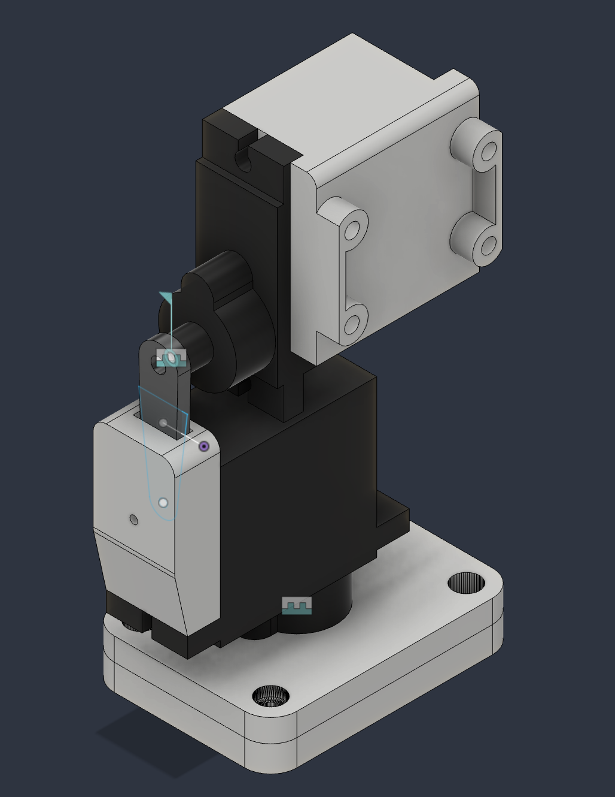

# Gimbal

A 2-axis object tracking gimbal powered by a Raspberry Pi 5. The system uses a Pi camera and OpenCV's CSRT correlation tracker to follow a user-selected target in real time, adjusting pan and tilt servos via proportional error feedback.

## Mechanical Design

The gimbal housing was designed in Fusion 360 and 3D printed.



## Hardware

- Raspberry Pi 5
- Raspberry Pi Camera Module (ribbon cable)
- PCA9685 16-channel PWM/servo driver board (I2C, default address `0x40`)
- 2x hobby servos (pan and tilt)

## Software Overview

| File | Description |
|------|-------------|
| `src/__main__.py` | Entry point |
| `src/config.py` | `GimbalConfig` context manager: camera setup, tracking loop, error computation, servo updates |
| `src/servo.py` | Servo hardware interface: setup, position updates, reset |
| `deploy.sh` | Deploys code to the Pi over SSH and runs it |

### How It Works

1. The camera captures a frame and the user selects a region of interest (ROI)
2. On each subsequent frame, the CSRT tracker locates the object
3. Normalized error is computed as the offset of the bounding box center from the frame center, scaled to [-1, 1]
4. Proportional gain (`kp`) converts the error into a servo angle adjustment
5. Servos are updated to recenter the object in the frame

## Setup

### Raspberry Pi

1. Install system dependencies:

```bash
sudo apt-get install -y swig liblgpio-dev
```

2. Create a virtual environment with access to system packages (required for `picamera2`):

```bash
python3 -m venv --system-site-packages .venv
```

3. Install Python dependencies:

```bash
.venv/bin/pip install -r src/requirements.txt
```

### Development Machine (macOS)

1. Install [XQuartz](https://www.xquartz.org/) for X11 forwarding (required to display the tracking window over SSH):

```bash
brew install --cask xquartz
```

Log out and back in after installing.

2. Ensure you have SSH key access to the Pi.

## Deployment

The `deploy.sh` script syncs the project to the Pi and runs it:

```bash
./deploy.sh
```

This will:
- Rsync the project files to the Pi
- Install dependencies
- Launch the tracking application with X11 forwarding

## Usage

1. Run `./deploy.sh` from the development machine
2. A camera preview window will appear. Select the object to track by drawing a bounding box, then press SPACE or ENTER
3. The gimbal will follow the selected object. Press `q` to quit

## Configuration

`GimbalConfig` accepts the following parameters:

| Parameter | Default | Description |
|-----------|---------|-------------|
| `channels` | `16` | Number of PCA9685 channels |
| `address` | `0x40` | I2C address of the PCA9685 board |
| `size` | `(640, 480)` | Camera resolution |
| `kp` | `10` | Proportional gain |
| `kd` | `0` | Derivative gain (not yet implemented) |
